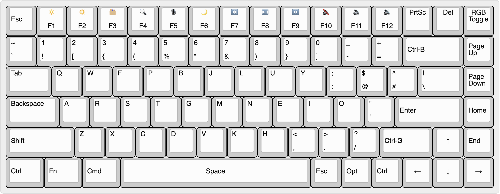

# QMK Layout – Keychron K2 HE (ANSI RGB)

This repo contains my custom QMK keymap (`mylayout`) for the **Keychron K2 HE** with Hall Effect switches and an ANSI RGB layout.  
Built on Keychron’s `hall_effect_playground` branch of QMK firmware.

---

## My Experimental Phase (Trying out Colemak Layout)
I am currently experimenting with the **Colemak-DHm** layout.
I know that Vim is designed with QWERTY in mind, so I have a toggle key to switch between QWERTY and Colemak-DHm.
I do that whenever I need to use Vim normal mode. It's a little jank, but it works for now.
No way am I going to learn Vim on Colemak-DHm again.



Pressing Fn toggles QWERTY mode.
I can also control more RGB effects in the Fn layer. 
> The Fn layer is not shown in the image

## 🛠️ Setup Instructions (macOS)

### 1. Install QMK CLI
```bash
brew install qmk/qmk/qmk
```

### 2. Clone the Correct Firmware Branch
```bash
git clone -b hall_effect_playground https://github.com/Keychron/qmk_firmware.git ~/qmk_firmware
git submodule update --init --recursive
qmk setup -H ~/qmk_firmware
```
This sets `~/qmk_firmware` as your QMK home directory.

### 3. (Optional but Recommended) Install QMK Toolbox
For easier firmware flashing:
```bash
brew install --cask qmk-toolbox
```

---

## 💻 Compiling the Firmware

Make sure you're in the QMK firmware root:
```bash
cd ~/qmk_firmware
```

(Optional) Update submodules:
```bash
qmk pull
# or
git submodule update --init
```

Then compile the firmware using your custom keymap:
```bash
qmk compile -kb keychron/k2_he/ansi_rgb -km mylayout
```

---

## 🧠 Notes

- This layout is in `keyboards/keychron/k2_he/ansi_rgb/keymaps/mylayout/`.
- You can flash the compiled `.bin` using QMK Toolbox.

---

## 📦 Repo Purpose

This repo only includes the keymap folder (`mylayout`) — not the full QMK firmware.  
You’ll still need to clone the full firmware from Keychron to compile it.
